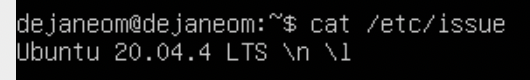

# Отчет по заданию "Операционные системы UNIX/Linux (Базовый)".
1. [Установка ОС](#part-1-установка-ОС)
2. [Создание пользователя](#part-2-создание-пользователя)
3. [Настройка сети ОС](#part-3-Настройка-сети-ОС)
4. [Обновление ОС](#part-4-Обновление-ОС)
5. [Использование команды sudo](#part-5-Использование-команды-sudo)
6. [Установка и настройка службы времени](#part-6-Установка-и-настройка-службы-времени)
7. [Установка и использование текстовых редакторов](#part-7-Установка-и-использование-текстовых-редакторов)
8. [Установка и базовая настройка сервиса SSHD](#part-8-Установка-и-базовая-настройка-сервиса-SSHD)
9. [Установка и использование утилит top, htop](#part-9-Установка-и-использование-утилит-top-htop)
10. [Использование утилиты fdisk](#part-10-Использование-утилиты-fdisk)
11. [Использование утилиты df](#part-11-Использование-утилиты-df)
12. [Использование утилиты du](#part-12-Использование-утилиты-du)
13. [Установка и использование утилиты ncdu](#part-13-Установка-и-использование-утилиты-ncdu)
14. [Работа с системными журналами](#part-14-Работа-с-системными-журналами)
15. [Использование планировщика заданий CRON](#part-15-Использование-планировщика-заданий-CRON)
## Условия задания
В качестве результата работы должен быть предоставлен отчет по выполненным задачам. В каждой части задания указано, что должно быть помещено в отчёт, после её выполнения. Это могут быть скриншоты, какие-то данные и т.д.
>* В репозиторий, в папку src, должен быть загружен отчёт с расширением .md.
>* В отчёте должны быть выделены все части задания, как заголовки 2-го уровня.
>* В рамках одной части задания всё, что помещается в отчёт, должно быть оформлено в виде списка.
>* Каждый скриншот в отчёте должен быть кратко подписан (что показано на скриншоте).
>* Все скриншоты обрезаны так, чтобы была видна только нужная часть экрана.
## Part 1. Установка ОС
Использованные команды:
```bash
cat /etc/issue
```

## Part 2. Создание пользователя
## Part 3. Настройка сети ОС
## Part 4. Обновление ОС
## Part 5. Использование команды sudo
## Part 6. Установка и настройка службы времени
## Part 7. Установка и использование текстовых редакторов
## Part 8. Установка и базовая настройка сервиса SSHD
## Part 9. Установка и использование утилит top, htop
## Part 10. Использование утилиты fdisk
## Part 11. Использование утилиты df
## Part 12. Использование утилиты du
## Part 13. Установка и использование утилиты ncdu
## Part 14. Работа с системными журналами
## Part 15. Использование планировщика заданий CRON