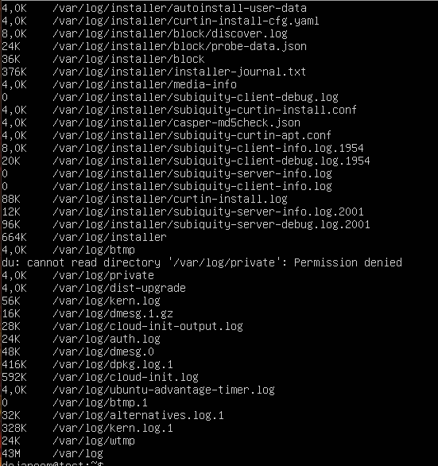
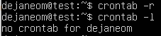

# Отчет по заданию "Операционные системы UNIX/Linux (Базовый)".
1. [Установка ОС](#part-1-установка-ос)
2. [Создание пользователя](#part-2-создание-пользователя)
3. [Настройка сети ОС](#part-3-настройка-сети-ос)
4. [Обновление ОС](#part-4-обновление-ос)
5. [Использование команды sudo](#part-5-использование-команды-sudo)
6. [Установка и настройка службы времени](#part-6-установка-и-настройка-службы-времени)
7. [Установка и использование текстовых редакторов](#part-7-установка-и-использование-текстовых-редакторов)
8. [Установка и базовая настройка сервиса SSHD](#part-8-установка-и-базовая-настройка-сервиса-sshd)
9. [Установка и использование утилит top, htop](#part-9-установка-и-использование-утилит-top-htop)
10. [Использование утилиты fdisk](#part-10-использование-утилиты-fdisk)
11. [Использование утилиты df](#part-11-использование-утилиты-df)
12. [Использование утилиты du](#part-12-использование-утилиты-du)
13. [Установка и использование утилиты ncdu](#part-13-установка-и-использование-утилиты-ncdu)
14. [Работа с системными журналами](#part-14-работа-с-системными-журналами)
15. [Использование планировщика заданий CRON](#part-15-использование-планировщика-заданий-cron)
## Условия задания
В качестве результата работы должен быть предоставлен отчет по выполненным задачам. В каждой части задания указано, что должно быть помещено в отчёт, после её выполнения. Это могут быть скриншоты, какие-то данные и т.д.
>* В репозиторий, в папку src, должен быть загружен отчёт с расширением .md.
>* В отчёте должны быть выделены все части задания, как заголовки 2-го уровня.
>* В рамках одной части задания всё, что помещается в отчёт, должно быть оформлено в виде списка.
>* Каждый скриншот в отчёте должен быть кратко подписан (что показано на скриншоте).
>* Все скриншоты обрезаны так, чтобы была видна только нужная часть экрана.
## Part 1. Установка ОС
1. Проверка установленной версии Ubuntu:
    ```bash
    cat /etc/issue
    ```
    
## Part 2. Создание пользователя
1. Создание нового пользователя
    ```bash
    sudo adduser hell
    ```
    
2. Добавление пользователя **hell** в группу **adm**
    ```bash
    sudo usermod -aG adm hell
    cat /etc/passwd
    ```
    
3. Проверка внесения пользователя **hell** в группу **adm**
    ```bash
    vi /etc/group
    ```
    
## Part 3. Настройка сети ОС
1. Задание машине имени **user-1**.
    * Вызов команды sudo `vim /etc/hostname` для смены названия машины
    * Замена старого названия <br>
    
    * На новое название <br>
    
    * Проверка названия машины после перезагрузки
    
2. Установка временной зоны, соотвутствующей моему положению, c помощью команды.
    ```bash
    sudo dpkg-reconfigure tzdata
    ```
    
3. Вывод названия сетевых интерфейсов с помощью консольной команды.
    ```bash
    ip addr show
    ```
    
    lo (local loopback) используется для того, чтобы компьютер мог обращаться к самому себе и имеет по умолчанию ip-адрес 127.0.0.1 на всех компьютерах.
4. Получение ip адреса устройства, от DHCP сервера.<br>
    DHCP (Dynamic Host Configuration Protocol) - это клиент-серверный протокол динамической конфигурации хоста , с помощью которого в ИТ-инфраструктуре сетевые параметры каждого нового устройства прописываются автоматически.<br> 
    
5. Определение внешнего ip-адреса шлюза и внутреннего IP-адреса шлюза.
    * внешний ip-адрес (ip)<br>
    
    * внутренний ip-адрес (gw)<br>
    
6. Установка статичных настроек ip, gw, dns.,br.<br>
    Откроем файл конфигурации **Netplan** командой `sudo nano /etc/netplan/00-installer-config.yaml` и зададим настройки ip, gw, dns.
    
7. После перезагрузки виртуальной машины настройки не изменились. Пингование удаленных хостов 1.1.1.1 и ya.ru прошло успешно.
    
    
## Part 4. Обновление ОС
1. Для обновления системных пакетов до последней на момент выполнения задания изпользуем команду `sudo apt update && sudo apt upgrade`
2. После повторного вызова данной команды получим следующий результат:
    
## Part 5. Использование команды sudo
1. Команда `sudo` ( substitute user and do, подменить пользователя и выполнить ) позволяет строго определенным пользователям выполнять указанные программы с административными привилегиями без ввода пароля суперпользователя **root**. 
2. Даем права на **sudo** пользователю **hell** командой `sudo usermod -aG sudo men`.
3. Обновление hostname:
* ` sudo su hell`
* ` sudo hostnamectl set-hostname test`
* ` hostnamectl` <br>

## Part 6. Установка и настройка службы времени
1. При установке настройки времени были применены автоматически
Использованные команды:
* `timedatectl show` <br>

## Part 7. Установка и использование текстовых редакторов
1. Создаем файл при помощи vim `vim test_vim.txt`
<br>
Пишем dejaneom, жмем `ESC`, пишем `:wq`
2. Создаем файл при помощи nano `nano test_nano.txt`
<br>
Пишем dejaneom, жмем `control+x`, жмем `y`, `enter`
3. * Устанавливаем редактор MCEDIT командой `sudo apt install mc`
* Создаем файл при помощи MCEDIT `mcedit test_mcedit.txt`
<br>
Пишем dejaneom, жмем `F2`, жмем `enter`, `F10`
4. Открываем файл при помощи vim `vim test_vim.txt`
<br>
Пишем `:%s/dejaneom/21 School 21/g` <br>
Для выхода без сохранения пишем `:q!`
5. Открываем файл при помощи nano `nano test_nano.txt`
<br>
Жмем `Ctrl+\` пишем dejaneom, жмем `Enter` пишем 21 School 21, жмем `control+x`, жмем `y`, `enter` <br>
Для выхода без сохранения жмём `control+X`, `N`, `enter`
6. Открываем файл при помощи MCEDIT `mcedit test_mcedit.txt`
<br>
Жмем `F4`, жмем `вниз`, пишем 21 School 21, жмем `enter`. <br>
Для выхода без сохранения жмём `f10`, `Нет`
7. Для поиска при помощи vim открываем файл и пишем `/` после текст для поиска
8. Для поиска при помощи nano открываем файл и жмем `control + W` после текст для поиска
9. Для поиска при помощи mcedit открываем файл и пишем `F7` после текст для поиска
## Part 8. Установка и базовая настройка сервиса SSHD
1. Установить службу SSHd `sudo apt install openssh-server`

2. Автозагрузка `sudo systemctl enable sshd`
3. Для изменения порта на 2022 требуется отредактировать файл nano /etc/ssh/sshd_config Найти и заменить `#Port 22` на `Port 2022` <br>

4. Для применения изменений `/etc/init.d/ssh restart`
5. **sshd** - это служба, принимающая запросы на соединения от клиентов. Обычно он запускается при загрузке системы из /etc/rc. Для каждого нового соединения создаётся (с помощью вызова fork) новый экземпляр службы. Ответвлённый экземпляр обрабатывает обмен ключами, шифрование, аутентификацию, выполнение команд и обмен данными. Эта реализация sshd поддерживает обе версии протокола SSH, 1 и 2, одновременно. 
6. Проверка наличия процесса sshd `ps -ef | grep sshd`

Опция -e, показывает все процессы, а -f показывает полную информацию: UID - идентификатор пользователя выполняющего команду, PID - это идентификатор процесса команды, PPID - идентификатор родительского процесса, который отпустил команду, C - количество дочерних процессов, STIME - это время начала процесса, TTY, TIME, CMD.
7. Устанавливаем и запускаем `sudo apt install net-tools`, далее `netstat -tan`

- a - показывать состояние всех сокетов. Обычно сокеты, используемые серверными процессами, не показываются.
- t - просмотр только tcp соединений
- n - показывать сетевые адреса как числа. netstat обычно показывает адреса как символы. Эту опцию можно использовать с любым форматом показа.
## Part 9. Установка и использование утилит top, htop
* Для установки пишем `sudo apt install htop`
* Запускаем `top`<br>

    - uptime: 3:31
    - количество авторизованных пользователей: 1
    - общая загрузка системы: 0,03, 0,02, 0,00
    - общее количество процессов: 96
    - загрузка памяти: 154,9
    - pid процесса занимающего больше всего памяти: 1
    - pid процесса, занимающего больше всего процессорного времени: 11
* Запускаем `htop`
    - отсортированный по PID <br>
    - отсортированный по PERCENT_CPU <br>
    - отсортированный по PERCENT_MEM <br>
    - отсортированный по TIME <br>
    - отфильтрованный для процесса sshd <br>
    - с процессом syslog, найденным, используя поиск <br>
    - с добавленным выводом hostname, clock и uptime <br>
## Part 10. Использование утилиты fdisk
* Для запуска утилиты fdisk пишем `sudo fdisk -l` <br>

* Из вывода мы видим, что название `sda`, `25 GiB`, `52428800` секторов, это же и есть размер swap 
## Part 11. Использование утилиты df
* Для запуска утилиты df пишем `df`<br>

    - размер раздела: 11758760
    - размер занятого пространства: 5200468
    - размер свободного пространства: 5939184
    - процент использования: 47%
    - единицы измерения пространства: Килобайты
* Для запуска утилиты df -Th корневого раздела пишем `df -Th`<br>

- T - Выдавать тип для каждой файловой системы. Тип берётся от операционной системы (и определяется системно-зависимым способом, например посредством чтения файла /etc/mtab).
- h - Отобразит размер в человеко-читаемом формате, размерностью 1024, добавив названия единиц (Kибибайт, Mебибайт, Гибибайт, Tебибайт).
    - размер раздела: 12G
    - размер занятого пространства: 5,0G
    - размер свободного пространства: 5,7G
    - процент использования: 47%
    - тип файловой системы раздела: ext4
## Part 12. Использование утилиты du
* Для запуска du нужно ввести `du` <br>

* Вывести размер папок /home, /var, /var/log `sudo du -s /home && sudo du -s /var && sudo du -s /var/log` <br>

* Вывести размер всего содержимого в /var/log `du -ah /var/log` <br>

## Part 13. Установка и использование утилиты ncdu
* Для установки ncdu пишем `sudo apt install ncdu`<br>

* Для запуска ncdu нужно ввести `ncdu`<br>

* Вывести размер папки /home
`sudo ncdu /home`<br>

* Вывести размер папки /var
`sudo ncdu /var`<br>

* Вывести размер папки и содержимого /var/log
`sudo ncdu /var/log`<br>

## Part 14. Работа с системными журналами
* Время последней успешной авторизации, имя пользователя и метод входа в систему<br>

* Перезапустить службу SSHd и показать логи<br>

## Part 15. Использование планировщика заданий CRON
* Установка cron `sudo apt install cron`
* Работа в фоновом режиме `sudo systemctl enable cron`<br>

* Для редактирования `crontab -e`, далее выбрать редактор
* Назначаем команду для запуска каждые 2 минуты `*/2 * * * * uptime`<br>

* Проверка автозапуска команды `uptime`<br>

* Проверяем текущие задачи cron `crontab -l`<br>

* Для удаления задач cron пишем `crontab -r`<br>


Готово!
